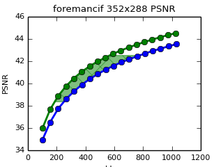
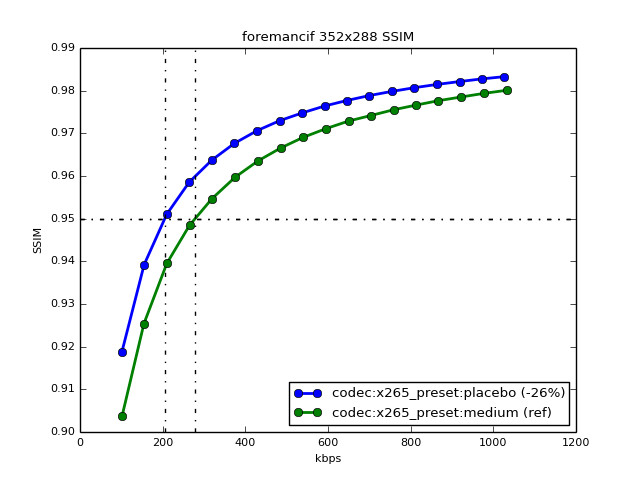
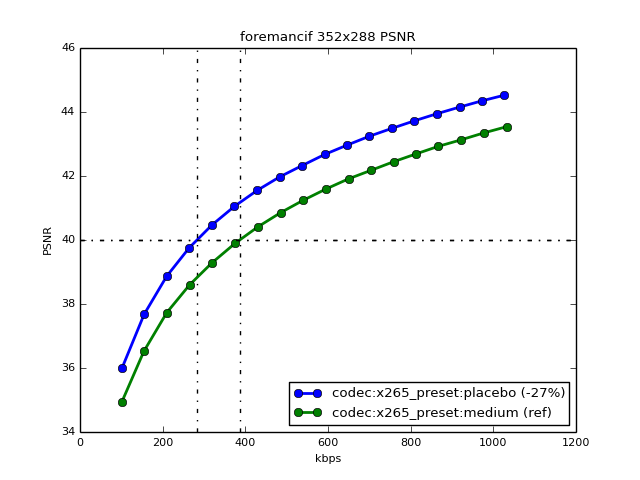
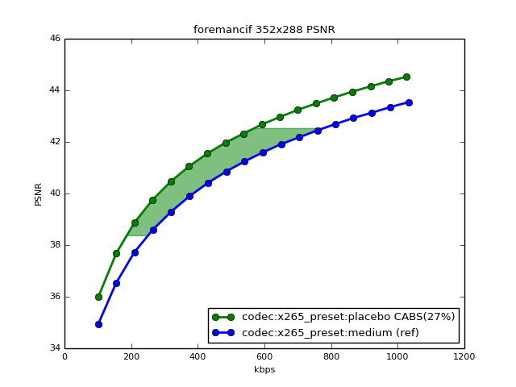

CODECbench
==========

## An open source video codec benchmarking tool ##


CODECbench is a video codec comparison tool. It allows you to analyze how one video codec performs against another, or with itself using different settings

You start by defining what stuff you want to analyze. For example, let's compare how x265 performs with its different presets 'medium' and 'placebo'. For this we will create a JSON configuration like the following:

```javascript
// we'll keep this on a file called x265bench.json
{
  "keeprecon" : false,
  "frame_count" : 300,
  "runs" : [
  {
        "seq" : ["foremancif"],
        "codec" : ["x265"],
        "bitrate_range" : [100,1000,50],
        "preset" : ["placebo","medium"]
  }
  ]
}
```

Notice the 'runs' section. It specifies to use the x265 codec and a range of bitrates from 100kbps to 1000kbps on 50kbps steps using the foremancif sequence. The range of presets of interest is defined.

Run this with codecbench:
```
codecbench -i x265bench.json
```

Here some magic happens. 

```
This is codecbench 0.4.9 [Alberto Vigata 2014] starting up on darwin-x86_64
added sequence cif/foreman.yuv [foremancif 352x288 420P 300F 25/1 fps]
loading x265bench.json
expanded bitrate list to: [100, 150, 200, 250, 300, 350, 400, 450, 500, 550, 600, 650, 700, 750, 800, 850, 900, 950]
expanded to 36 runs
running bitrate_100__codec_x265__preset_placebo__seq_foremancif__ 0/36
running bitrate_150__codec_x265__preset_placebo__seq_foremancif__ 1/36
running bitrate_200__codec_x265__preset_placebo__seq_foremancif__ 2/36
...
```

CODECbench figures out all possible combinations of this configuration and actually encodes the sequence in every one setting. Every settings is a 'run'. This can take a while, but a subdirectory 'runs' is created in where your config file is and the resulting bitstream and video metrics information is written there for later. 

You don't have to worry about configuring the codecs at all. CODECbench is modular, and the codecs are provided to you (there are some installed by default) as 'codec packs'. Codec packs have all its needed to interact with CODECbench and you can just invoke them on the configuration file with their nickname, in the example above 'x265'. You just need to drop the codec pack in the 'codecpacks' folder for this to work.

Sequences are similar. You can drop prepared yuv sequences on the sequences directory and use them with their nickname. All the details about formats, frame sizes and frame rates are handled automatically.

## Reporting ##
CODECbench wouldn't be very useful if it didn't give you information about the actual performance of the codec under test. Even after running all the runs you end with bitstreams and metrics information this is not terribly useful per se. CODECbench can then generate reports on that compiled data. To get reports add a report section to the configuration file:

```javascript
{
    "sequence_dirs": ["../seq"],
    "codec_dirs" : ["../codecs"],
    "keeprecon" : false,
    "frame_count" : 300,
    "runs" : [
    {
        "seq" : ["foremancif"],
        "codec" : ["x265"],
        "bitrate_range" : [100,1000,50],
        "preset" : ["placebo","medium"]
    }
    ],
    "reports" : {
        "defaults" : {
            "res" : "640x480",
            "fontsize" : 8,
            "format" : "svg"
        },
        "reports": [
        {
            "ref" : 0.95,
            "metric" : "ssim"
        },
        {
        "ref" : 40,
        "metric" : "psnr"
        }
    ]
} 
}
```
This will produce the following SSIM report on the reports folder. The 'ref' marker on the reports array can be used for CODECbench to calculate the bitrate savings at a specific quality point. In the example we are using 0.95 for SSIM point at which the placebo configuration gives 26% bitrate savings.




The configuration file also adds a PSNR report with a reference of 40. This is the result:


Using PSNR gives us also 27% bitrate savings for a value of 40dB, not bad. We can do better though in our analysis. CODECbench can also automatically calculate the [CABSscore](http://codecbench.nelalabs.com/cabs) for this configuration. [Visit this page to learn more about the CABSscore](http://codecbench.nelalabs.com/cabs) . To get a CABSscore, we need to define a bitrate of interest so we'll go for a range between 400 and 1000 kbps for foreman CIF. Add a 'bitrate_range' parameter in the config file and also set the report to show the 'cabs_area' like this:
```javascript
 ...
     "reports" : {
         "defaults" : {
              "res" : "640x480",
              "fontsize" : 8,
              "format" : "svg",
              "bitrate_range": [400,1000],
              "cabs_area" : true
          },
          "reports": [
          {
...
```

This results in the following:



The green area is the CABS area. Its the area between 400 and 1000 kbps from the reference curve (medium preset) and the bitrate savings for every point. The average bitrate savings in all this point is unsurprisingly 27% so our previous measurement at just 40dB was quite close to the real CABSscore.
##Codec Packs##
A codec pack extends CODECbench to support a particular codec. From a user point of view they are just folders with files you can drop in into the 'codecpacks' folder. When you run CODECbench it should automatically detect it and be ready for use. Like sequences, codec packs are identified with a nickname. For example 'x264', 'x265' or 'libvpx'. You use their nickname to refer to them in configuration files.
###Writing your own codec pack###
In its essense a codec pack is the binaries that form part of the encoder and a bit of python glue to interact with CODECbench. On startup CODECbench looks for a 'codec.py' file inside the folders of the 'codecpacks' directory. If present file is loaded and used for interaction with the codecpack. Take a look at the provided codec packs if you want to make your own, it should be relatively simple.
###Provided codec packs###
Some codec packs are provided as default:
####x264####
You use this codec pack adding:
* **codec** parameter with value 'x264'
* **preset** parameter with one of the x264 command line presets (ultrafast,fast,medium,slow,placebo ...)
* **bitrate** this is the sweep parameter that generates streams of different size

####x265####
You use this codec pack adding:
* **codec** parameter with value 'x265'
* **preset** parameter with one of the x265 command line presets (ultrafast,fast,medium,slow,placebo ...)
* **bitrate** this is the sweep parameter that generates streams of different size

####libvpx####
You use this codec pack adding:
* **codec** parameter with value 'libvpx'
* **libvpx_codec** parameter telling the specific codec to use inside libvpx 'vp8' or 'vp9'
* **cpu** parameter mapped to command line. 0 for slow, 1 for faster, ... 16 for realtime
* **bitrate** this is the sweep parameter that generates streams of different size

##Configuration options##
**keeprecon** [true|false]{optional,global,run}
: if true directs the codec pack to not delete the temporary yuv reconstructed sequences  

**frame_count** [int]{optional,global,run}
: limits the number of frames to be encoded to the int number specified

**ignore** [true|false]{optional,run}
: makes the configuration parser to ignore this particular configuration. It is sometimes useful while working on a setup to disable a particular set of configurations in the file. Setting "ignore":true, will achieve the effect of ignoring the selected configuration temporarily.

**clobber** [true|false]{optional,run}
: deletes the destination directory of the run. Use this if you are having problems with specific runs and you want to start from fresh.

##Requirements##
* **python3** was used to write CODECbench so you'll require a python3 install
* **matplotlib, scipy and numpy** are required if you want to generate reports
* **a codec pack for your native platform**, codec packs run natively and usually come with binaries to be run on most common platforms. A codec pack won't run if it doesn't provide native binaries for your platform

##About me##
My name is Alberto Vigata and I love all things video engineering related. I've been working on them profesionally for a while. You can [check my personal profile on Linked In](https://www.linkedin.com/in/vigata)

